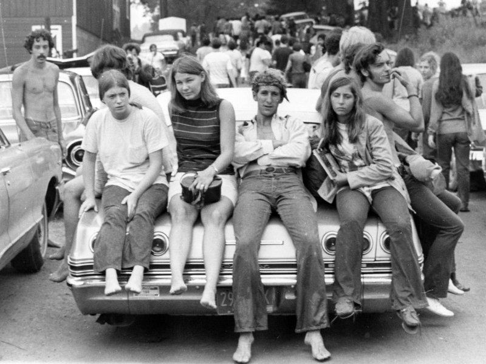
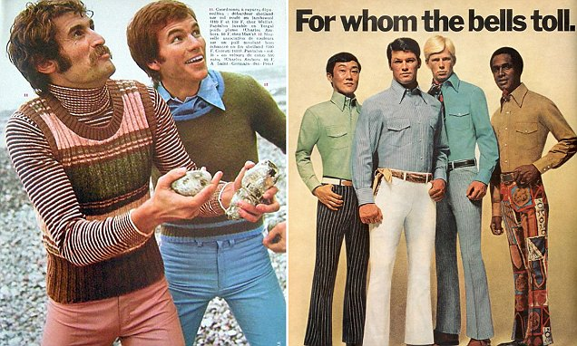
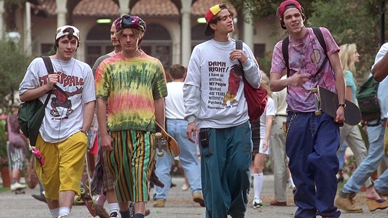

## Rules

- There is one song for every decade from 1920s - 2020
- One point for each song title
- One point for each artist

## Question 1
<audio controls><source src="1920s.mp3" type="audio/mp3"></audio>
</img>

## Question 2
<audio controls><source src="1930s.mp3" type="audio/mp3"></audio>
</img>

## Question 3
<audio controls><source src="1940s.mp3" type="audio/mp3"></audio>
</img>

## Question 4
<audio controls><source src="1950s.mp3" type="audio/mp3"></audio>
</img>

## Question 5
<audio controls><source src="1960s.mp3" type="audio/mp3"></audio>
</img>

## Question 6
<audio controls><source src="1970s.mp3" type="audio/mp3"></audio>
</img>

## Question 7
<audio controls><source src="1980s.mp3" type="audio/mp3"></audio>
</img>

## Question 8
<audio controls><source src="1990s.mp3" type="audio/mp3"></audio>
</img>

## Question 9
<audio controls><source src="2000s.mp3" type="audio/mp3"></audio>
</img>

## Question 10
<audio controls><source src="2010s.mp3" type="audio/mp3"></audio>
</img>

